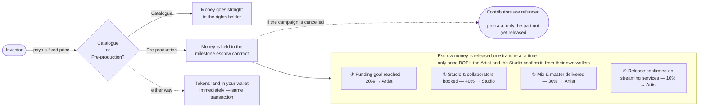

# How Humfiverse Works

## Two products

Humfiverse offers two ways to invest, and treats them as genuinely different, not two flavors of the same pitch:

- **Catalogue tokenization.** A song or catalogue that's already out and already earning royalties gets tokenized. You're buying a share of income that already exists. This is the safer, bond-like product.
- **Pre-production financing.** An artist uploads an unfinished track — a demo, a rough idea — and token sales pay for finishing it: studio time, musicians, mixing and mastering. You're buying a share of income that doesn't exist yet, betting the track gets made and does well. This is the riskier, venture-like product. Most crowdfunded creative projects don't fully pay back their backers, and Humfiverse says so plainly rather than hiding that risk behind the first product's safer profile.

Both work the same way underneath: a legal entity holds the real royalty right, and your token is a claim against *that entity* — never a claim on the copyright itself. See [Legal & Regulatory Structure](05-legal-structure.md).

## Where the money goes

For a catalogue, buying is simple: pay, receive your tokens, done — one transaction. For pre-production, your tokens still land in your wallet immediately, but *your money* sits in the escrow contract and only reaches the artist and studio as the track actually gets made. Neither Humfiverse nor the artist can touch it early, and no single side can release it alone — a milestone pays out only when the artist and the studio *both* confirm, independently, that it genuinely happened. If they disagree, the money simply stays locked; there's no arbitration, on purpose (see [Governance](06-governance.md) for why).

If a campaign gets cancelled, contributors get refunded for whatever hasn't been paid out yet. Money already released for milestones genuinely delivered stays with whoever earned it.

Once a track is actually earning royalties — from either product — that income gets collected and paid out to token holders periodically. A smart contract can automate that payout once the money reaches an account it controls, but it can't reach into Spotify or a collecting society and pull the money out by itself. Someone has to confirm "this royalty payment really arrived" before the contract can act on it. That confirmation step is the hardest, most important part of this whole system — see [Technical Architecture](03-technical-architecture.md) for how Humfiverse handles it honestly rather than glossing over it.

## Why an escrow, specifically

A pre-blockchain platform called PledgeMusic tried something similar and collapsed in 2019 — it had been using new campaigns' money to pay off older campaigns, and when growth outpaced its books, artists were left owed hundreds of thousands of dollars that had simply vanished. Humfiverse's escrow is a direct, structural answer to that exact failure: the money is never in one pool anyone can dip into. It's a stronger guarantee than a traditional crowdfunding platform can offer, and — unlike a lot of whitepaper promises — it's real, deployed, and checkable on a block explorer today, not just a design on paper.

## Not a trading venue

Humfiverse's payout system (collect confirmed royalty income, let holders claim their share) is deliberately kept separate from any future system for reselling tokens between holders. A price that moves automatically, set by an algorithm matching buyers and sellers, would cross into running a regulated trading venue — a much heavier license than issuing tokens. So that's not built. Resale, where it exists, works more like a classified ad than a stock exchange: a holder lists tokens at a price they choose, and a buyer takes it or doesn't. See [Legal & Regulatory Structure](05-legal-structure.md).
