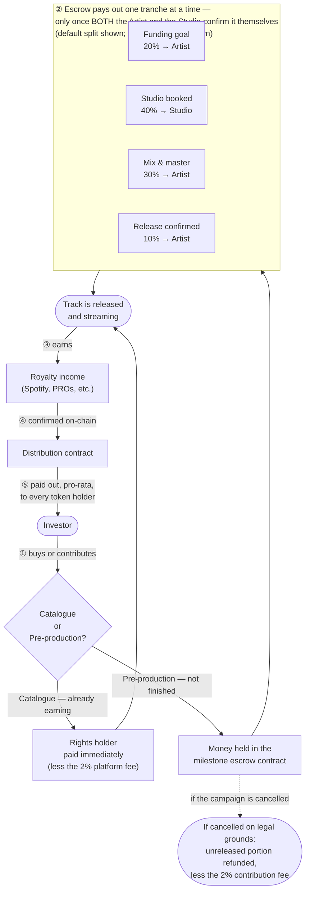

# How Humfiverse Works

## Two products

Humfiverse offers two ways to invest, and treats them as genuinely different, not two flavors of the same pitch:

- **Catalogue tokenization.** A song or catalogue that's already out and already earning royalties gets tokenized. You're buying a share of income that already exists. This is the safer, bond-like product.
- **Pre-production financing.** An artist uploads an unfinished track — a demo, a rough idea — and token sales pay for finishing it: studio time, musicians, mixing and mastering. You're buying a share of income that doesn't exist yet, betting the track gets made and does well. This is the riskier, venture-like product. Most crowdfunded creative projects don't fully pay back their backers, and Humfiverse says so plainly rather than hiding that risk behind the first product's safer profile.

Both are designed to work the same way underneath: in the planned structure, a legal entity will hold the real royalty right, and your token will be a claim against *that entity* — never a claim on the copyright itself. No such entity exists yet, and on today's testnet contracts a catalogue sale pays the artist's wallet directly. See [Legal & Regulatory Structure](05-legal-structure.md).

## The full money loop

Not just where an investor's money goes on the way in — the whole round trip, including how it eventually comes back as a payout:

Step by step:

1. **The investor pays**, and their tokens land in their wallet immediately — one transaction, whichever product it is.
2. **For a catalogue**, that's it — the rights holder is paid right away, less the 2% platform fee, because the track is already earning. **For pre-production**, the money instead sits in the escrow contract and reaches the artist and studio tranche by tranche, as soon as enough has been raised to cover each one — which can happen before the whole goal is reached. The artist decides, when creating the campaign, how much of the raise each milestone releases. A tranche pays out only once the artist and the studio *both* confirm, independently, that the milestone genuinely happened; a campaign with no studio is released on the artist's confirmation alone. If artist and studio disagree, the money stays in the escrow; there's no arbitration, on purpose (see [Governance](06-governance.md)). Campaigns have no deadline: one ends when it sells out, releases everything, or is cancelled.

   **Cancellation.** The platform can cancel a campaign. It commits to doing so only on stated legal grounds — unlawful content, infringement of someone else's rights, or false artist warranties about them — after notifying the artist and giving them 5 days to respond, except where the law requires immediate removal. The contract itself does not check the ground, and the notice procedure is still being built. Cancelling stops all further releases and refunds the part not yet released, pro rata. The 2% contribution fee is not refunded. Money already released stays with whoever received it, but investors keep their claims against the artist for it and for damages. Today's testnet escrow refunds the wallets that contributed; the next contract version is planned to refund whoever holds the tokens at cancellation. Tokens bought on resale carry no refund right until then.
3. **The track releases and starts earning** royalties from streaming, licensing, and performance.
4. **That income has to be confirmed on-chain** before anything can happen with it — a smart contract can't reach into Spotify and pull money out by itself. Someone has to confirm "this royalty payment really arrived." That confirmation step is the hardest, most important part of the whole system — see [Technical Architecture](03-technical-architecture.md) for how Humfiverse handles it honestly rather than glossing over it.
5. **Confirmed income gets paid out**, pro-rata, to every token holder — closing the loop back to the investor.

## Why an escrow, specifically

A pre-blockchain platform called PledgeMusic tried something similar and collapsed in 2019 — it had been using new campaigns' money to pay off older campaigns, and when growth outpaced its books, artists were left owed hundreds of thousands of dollars that had simply vanished. Humfiverse's escrow is a direct, structural answer to that exact failure: each campaign's money is accounted for separately inside the escrow contract, and its tests show that one campaign cannot spend another's funds. It's a stronger guarantee than a traditional crowdfunding platform can offer, and — unlike a lot of whitepaper promises — it's real, deployed, and checkable on a block explorer today, not just a design on paper.

## Resale is kept simple, and its legal status is still open

Humfiverse's payout system (collect confirmed royalty income, let holders claim their share) is deliberately kept separate from any future system for reselling tokens between holders. A price that moves automatically, set by an algorithm matching buyers and sellers, would cross into running a regulated trading venue — a much heavier license than issuing tokens. So that's not built. Resale, where it exists, uses individually priced listings: a holder lists tokens at a price they choose, a buyer takes it or doesn't, and the platform retains 1%. Whether even this simpler form of resale can be offered for real, and under which licence, is an open legal question that counsel has not yet answered. See [Legal & Regulatory Structure](05-legal-structure.md).
